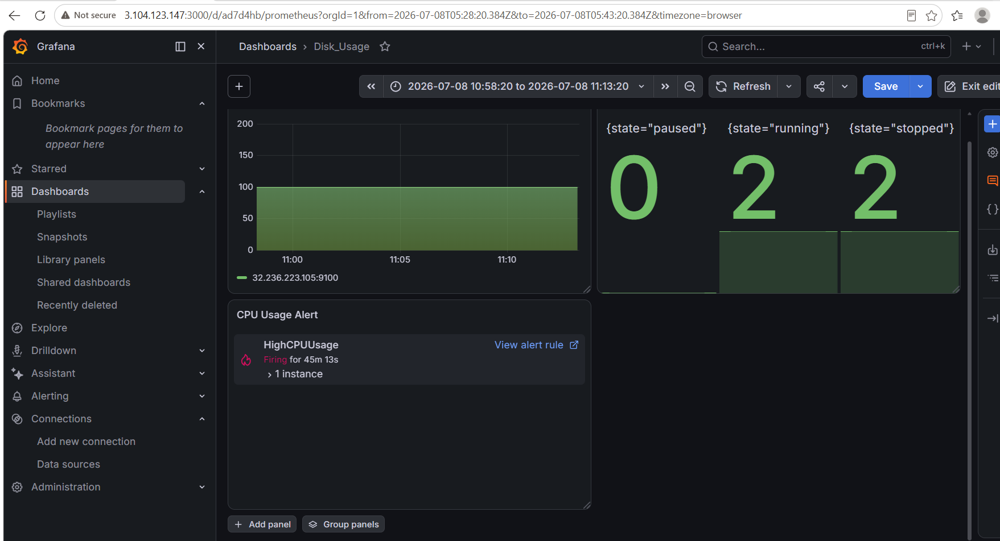
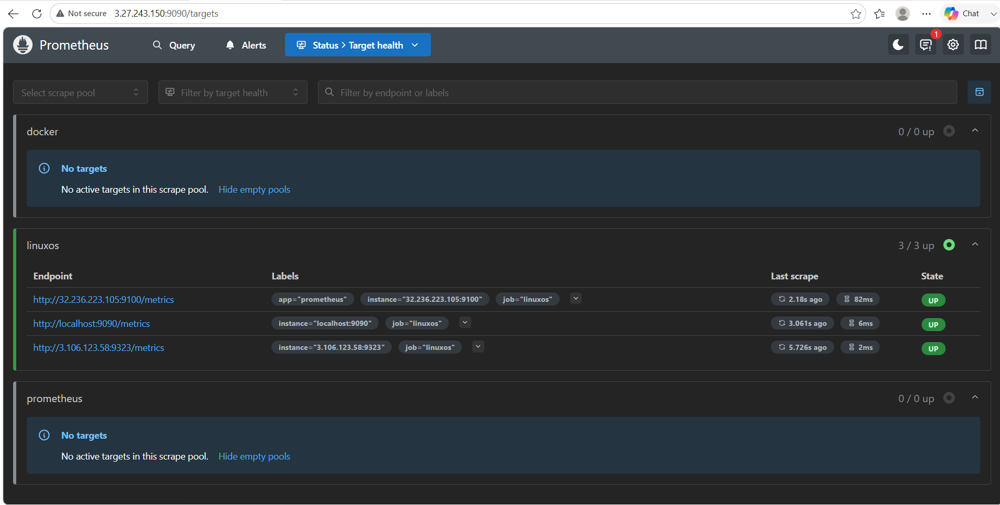
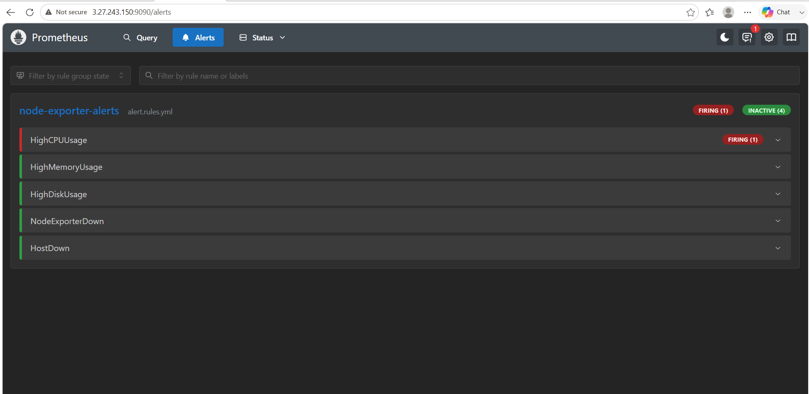

# Production-Monitoring-Incident-Automation-Platform


## Overview

This project demonstrates a production-grade monitoring solution built on AWS EC2 using Prometheus, Grafana, and Node Exporter.

The platform continuously monitors Linux servers, visualizes infrastructure metrics, and generates alerts for high CPU, memory, and disk usage.

---

## Business Use Case

A banking application runs across multiple Linux servers on AWS.

The Production Support team requires continuous monitoring to detect:

- High CPU utilization
- High Memory utilization
- High Disk usage
- Node failures
- Server availability

This project simulates a real Production Support environment where alerts are generated before customers are impacted.

---

## Architecture

AWS EC2

```
Linux Server 1 (Node Exporter)
          │
Linux Server 2 (Node Exporter)
          │
Linux Server 3 (Node Exporter)
          │
      Prometheus
          │
      Alert Rules
          │
      Grafana Dashboard
```

---

## Tech Stack

- AWS EC2
- Linux
- Docker
- Prometheus
- Grafana
- Node Exporter
- PromQL
- Bash

---

## Monitored Metrics

- CPU Usage
- Memory Usage
- Disk Usage
- Filesystem Usage
- Network Traffic
- Host Availability

---

## Configured Alerts

| Alert | Threshold |
|--------|-----------|
| High CPU | >80% |
| High Memory | >85% |
| High Disk | >90% |
| Node Exporter Down | Node Unreachable |
| Host Down | Host Unreachable |

---

## Screenshots

### Grafana Dashboard



### Prometheus Targets



### CPU Alert



---

## Incident Simulation

High CPU was simulated using Linux commands.

```

yes > /dev/null &
yes > /dev/null &
yes > /dev/null &
yes > /dev/null &

```

Prometheus detected the issue and changed alert status:

Inactive

↓

Pending

↓

Firing

---

## Linux Commands Used

```

top
htop
vmstat
free -m
df -h
ps -ef

```

---

## Future Enhancements

- Alertmanager Email Notifications
- Loki
- Promtail
- Blackbox Exporter
- cAdvisor
- Kubernetes Monitoring

---

## Resume Highlights

Designed and implemented a production-grade monitoring platform using Prometheus, Grafana, Node Exporter, and AWS EC2 to monitor Linux infrastructure, visualize real-time metrics, configure alerting, and simulate production incidents.
